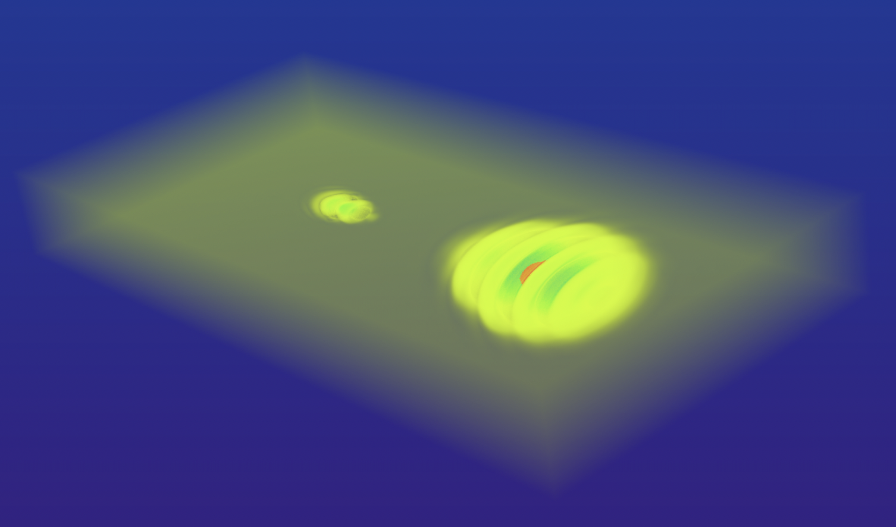
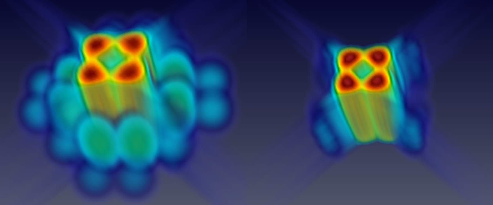

# HEWES: Heisenberg-Euler Weak-Field Expansion Simulator

The Heisenberg-Euler Weak-Field Expansion Simulator is a solver for the all-optical QED vacuum.
It solves the equations of motion for electromagnetic waves in the weak-field expansion of the Heisenberg-Euler effective theory with up to six-photon processes.

There is a [paper](https://arxiv.org/abs/2109.08121) that introduces the algorithm and shows remarkable results
and a [Mendeley Data repository](https://data.mendeley.com/datasets/f9wntyw39x) with extra and supplementary materials.

## Contents
- [Required software](#required-software)
- [Short user manual](#short-user-manual)
    - [Note on simulation settings](#note-on-simulation-settings)
    - [Note on resource occupation](#note-on-resource-occupation)
    - [Note on the output analysis](#note-on-the-output-analysis)
- [Authors](#authors)

## Required software
_CMake_ is used for building and a recent _C++_ compiler version is required
since features up to the _C++20_ standard are used.
An _MPI_ implementation supporting the _MPI_ 3.1 standard is required.
_OpenMP_ is optional to enforce more vectorization and enable multi-threading.
The latter extra layer of parallelization is useful for performance only when a
very large number of compute nodes is occupied.

The [_CVODE_](https://computing.llnl.gov/projects/sundials) solver is fetched on-the-fly through _CMake_.  
If _CVODE_ (or the whole [_SUNDIALS_](https://computing.llnl.gov/projects/sundials/cvode) package) is installed manually:
Version 6 is required, the code is presumably compliant with the upcoming version 7.
Enable _MPI_ (and _OpenMP_).
For optimal performance the `CMAKE_BUILD_TYPE` should be "Release".
Edit the `SUNDIALS_DIR` variable in the `CMakeLists.txt` to the installation
directory.

## Short user manual

In order to build the executable with _CMake_, execute, e.g., in the [`src`](src) directory,
`cmake -S. -Bbuild` and then `cmake --build build`.

You have full control over all high-level simulation settings with command
line arguments.

- First, the general settings are specified:
    - The path to the project directory.
    Therein, a `SimResults` folder is created and therein a folder named after the timestamp of
    the start of the simulation.
    - Whether you want to simulate in 1D, 2D, or 3D.
    - The relative and absolute integration tolerances of the _CVODE_ solver.  
    Recommended values are between 1e-12 and 1e-16.
    - the order of accuracy of the numerical scheme (the stencil order).
    You can choose an integer in the range 1-13.
    - The physical side lengths of the grid in meters.
    - The number of lattice points per dimension.
    - The slicing of the lattice into patches (relevant only for 2D and 3D simulations, automatic in 1D) – this determines the number of patches and therefore the required distinct processing units for _MPI_.  
    The total number of processes is given by the product of slices in any dimension.  
    Note: In the 3D case patches should be chosen cubic in terms of lattice points.
    This is decisive for computational efficiency.
    - Whether you want to simulate in the linear vacuum (0), on top of the linear vacuum only 4-photon processes (1), only 6-photon processes (2), or 4- and 6-photon processes (3).
    - The total time of the simulation in units c=1, i.e., the distance propagated by the light waves in meters.
    - The number of time steps that will be solved stepwise by _CVODE_.   
    In order to keep interpolation errors small do not choose this number too small.
    - The multiple of steps at which you want the field data to be written to disk.  
    - The output format. It can be csv (comma-separated-values) or binary.
    For csv format the name of the files written to the output directory is of the form `{step_number}_{process_number}.csv`.
    For binary output all data per step are written into one file and the step number is the name of
    the file.
- Second, the electromagnetic waves are chosen and their parameters specified.
    You can choose plane waves (not much physical content, but useful for checks) and implementations of Gaussian pulses in 1D, 2D, and 3D.
    To see which command line argument is which paramter, see the comments in
    the short example _Bash_ run scripts which are preconfigured for [1D](src/run_1D_ex.sh),
    [2D](src/run_2D_ex.sh), and [3D](src/run_3D_ex.sh) simulations.
    Amplitudes are given in units of the critical field strength (Schwinger limit).
    Position and propagation parameters on the y- and z-axis are only effective if the grid has an extend in the corresponding dimension.  
    A description of the wave implementations is given in the _Doxygen_-generated [code reference](docs/ref.pdf).
    Note that the 3D Gaussians, as they are implemented up to now, are propagated only in the xy-plane.
    More waveform implementations will follow in subsequent versions of the code.

The boundaries are periodic.

Note that in 2D and 3D simulations the number of _MPI_ processes has to coincide with the actual number of patches, as described above.  
If the program was built with _OpenMP_ support, the environment variable `OMP_NUM_THREADS` needs
to be set.

It can be useful to save the run script along with the output as a log of the
simulation settings for later reference.

Monitor stdout and stderr during the run (or redirect into files).
The starting timestamp, the process steps, and the used wall times per step are printed on stdout.
Errors are printed on stderr.  
Note: Convergence of the employed _CVODE_ solver cannot be guaranteed and issues of this kind can hardly be predicted.
On top, they are even system-dependent.
Piece of advice: Only pass decimal numbers for the grid settings and initial conditions.  
_CVODE_ warnings and errors are reported on stdout and stderr.  

### Note on simulation settings
You may want to start with two Gaussian pulses in 1D colliding head-on in a pump-probe setup.
For this event, specify a high-frequency probe pulse with a low amplitude and a low-frequency pump pulse with a high frequency.
Both frequencies should be chosen to be below a forth of the Nyquist frequency to minimize nonphysical dispersion effects on the lattice.
The wavelengths should neither be chosen too large (bulky wave) on a fine patchwork of narrow patches.
Their communication might be problematic with too small halo layer depths.
You would observe a blurring over time.
The amplitudes need be below 1 – the critical field strength – for the weak-field expansion to be valid.  
You can then investigate the arising of higher harmonics in frequency space via a Fourier analysis.
The signals from the higher harmonics can be highlighted by subtracting the results of the same simulation in the linear Maxwell vacuum.
You will be left with the nonlinear effects.  
Choosing the probe pulse to be polarized with an angle to the polarization of the pump you may observe a fractional polarization flip of the probe due to their nonlinear interaction.  
Decide beforehand which steps you need to be written to disk for your analysis.

Example scenarios of colliding Gaussians are preconfigured for any dimension in
the example scripts.

### Note on resource occupation
The computational load depends mostly on the grid size and resolution.
The order of accuracy of the numerical scheme and _CVODE_ are rather
secondary, except for simulations running on many processing units. 
There, the communication load plays a major role which in turn depends on the
order of the numerical scheme.
This is because the the order of the scheme determines how many neighboring
grid points are taken into account for the finite differences derivatives.

Simulations in 1D are relatively cheap and can easily be run on a modern
notebook within some seconds.
The output size per step is less than a megabyte.
Simulations in 2D with about one million grid points are still feasible for a
personal machine and still take only some minutes.
The output size per step is in the range of some dozen megabytes.
Sensible simulations in 3D require large memory resources and therefore need to
be run on distributed systems.
This means an increased communication load.
Even hundreds or thousands of cores can be kept busy for many hours or days.
The output size quickly amounts to hundreds of gigabytes for just a single
state.
This hurdle forms a practical limit to the grid resolution.

Some scaling tests are shown in the [paper](https://arxiv.org/abs/2109.08121).

If the output is in binary form, the size can be easily calculated.  Per step
it is the number of grid points times six (the number of field components)
times 8 bytes.

### Note on the output analysis
The field data are either written in csv format to one file per MPI process, the ending of which (after an underscore) corresponds to the process number, as described above.
This is the simplest solution for smaller simulations and a portable way that also works fast and is
straightforward to analyze.  
Or, the option strictly recommended for larger write operations, in binary format with a single file per output step.
Raw bytes are written to the files as they are in memory.
This option is more performant and achieved with the help of _MPI IO_.
However, there is no guarantee of portability; postprocessing/conversion is required.
The step number is the file name.  
A `SimResults` folder is created in the chosen output directory if it does not exist and therein a folder named after the starting timestamp of the simulation (in the form `yy-mm-dd_hh-MM-ss`) is created.
This is where the output files are written into.

There are six columns in the csv files, corresponding to the six components of the electromagnetic field: $`E_x`$, $`E_y`$, $`E_z`$, $`B_x`$, $`B_y`$, $`B_z`$.
Each row corresponds to one lattice point.  
Postprocessing is required to read-in the files in order.
[A Python module](examples/get_field_data.py) taking care of this is provided.  
Likewise, [another Python module](examples/get_binary_field_data.py) is provided to read the binary
data of a selected field component into a _numpy_ array.
For its use, the byte order of the reading machine has to be the same as that
of the writing machine.

More information describing settings and analysis procedures used for actual scientific results are given in an open-access [paper](https://arxiv.org/abs/2109.08121)
and a collection of corresponding analysis notebooks are uploaded to a [Mendeley Data repository](https://data.mendeley.com/datasets/f9wntyw39x).
Some small example Python analysis scripts can be found in the [examples](examples).
The [first steps](examples/first_steps) demonstrate how the simulated data is correctly read-in from disk to _numpy_ arrays using the provided [get field data module](examples/get_field_data.py).
[Harmonic generation](examples/harmonic_generation) in various forms is sketched as one application showing nonlinear quantum vacuum effects.  
Analyses of 3D simulations are more involved due to large volumes of data.
A script with the purpose to extract the ratio of polarization flipped photons
of a laser pulse due to vacuum birefringence can be found
[here](examples/birefringence.py).
Visualization requires tools like _Paraview_, as used for the cover figures.

## Authors
- Arnau Pons Domenech
- Hartmut Ruhl (hartmut.ruhl@physik.uni-muenchen.de)
- Andreas Lindner (and.lindner@physik.uni-muenchen.de)
- Baris Ölmez (b.oelmez@physik.uni-muenchen.de)

